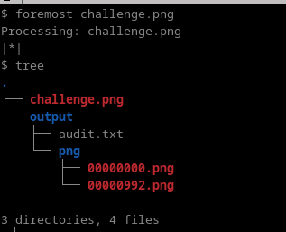
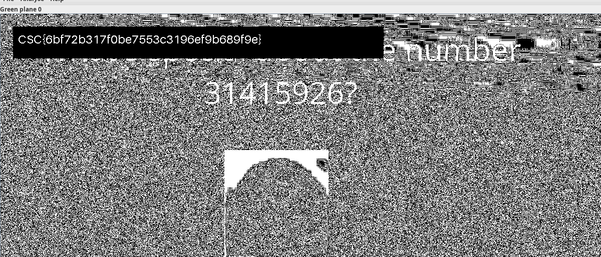

# CaptureTheFutoor Forensics challenge 1

There's only one png file, which is `challenge.png`. By openning the image, the only thing that might look interesting is the hint `You don't know stegsolve?`.

However, when using stegsolve, we see that there's nothing there.

If we try extracting files using `binwalk` or `foremost`, we can see that there's another hidden image.

The first png is the same image we had. The second one is the hidden one.

Again, misleading hint. However, the previous hint stated stegsolve. When running stegsolve on that image, we the flag is on green bit plane 0.

