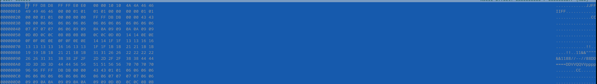
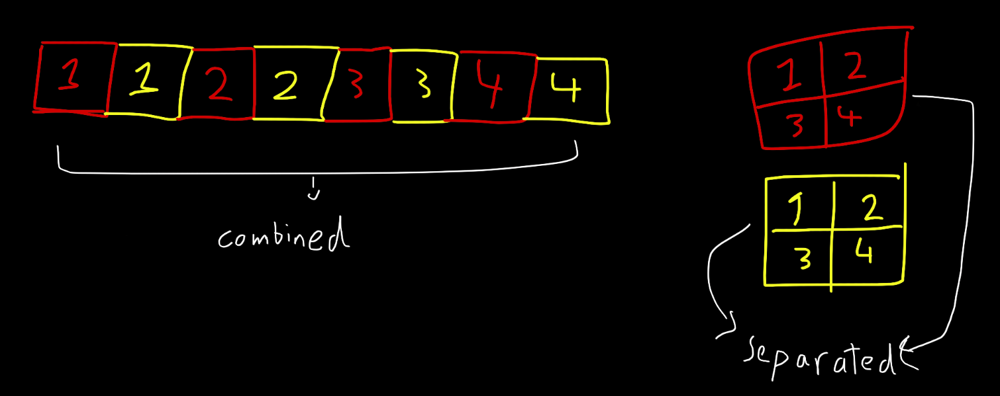
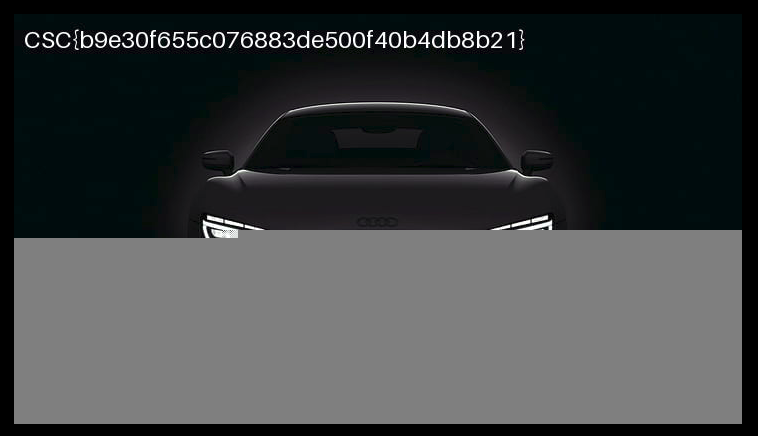

# CaptureTheFutoor Forensics challenge 3

We can see the file `secret` is unkown. Trying different tools on it won't work (binwalk, foremost, etc). However, when inspecting the bytes of the file, we can notice something familiar.



Notice the `JJFFIIFF`. It's familiar to the normal JFIF we see in each JPEG header right? But this time, each character is repeater twice. The most probable conclusion is that it's two JPEGs mixed in a single file, but one byte from each JPEG and one byte from the other one and so on. Look at the below image to understand:



To assemble the images again, we have to write a script that will divide the bytes to two files. 

Here's simple Python script that does the job:

```python
with open("secret", "rb") as f:
    b = f.read()

bytes1, bytes2 = bytearray(), bytearray()

for i in range(len(b)):
    if i%2==0:
        bytes1.append(b[i])
    else:
        bytes2.append(b[i])

with open("image1.jpeg", "wb") as f:
    f.write(bytes1)

with open("image2.jpeg", "wb") as f:
    f.write(bytes2)
```

The flag is in image 3.



The aim of this challenge was only to make you rely on your logic, not merely on automated tools.