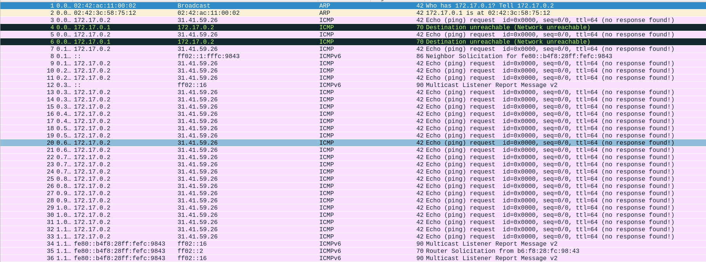
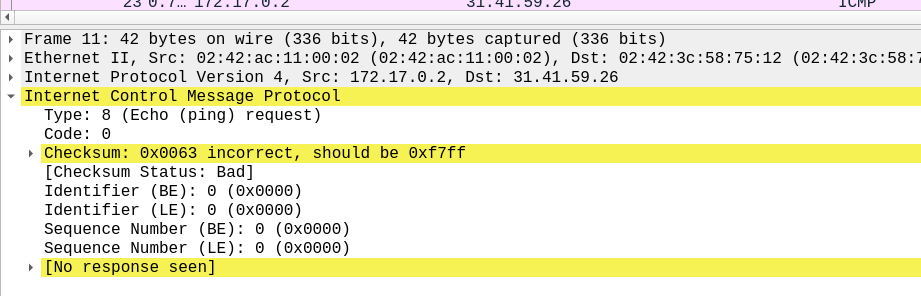
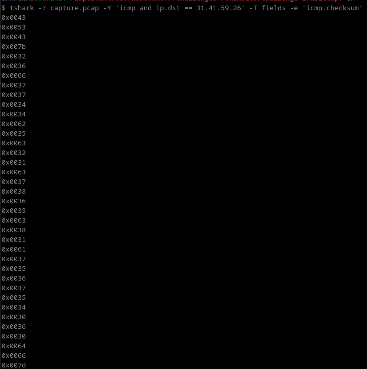
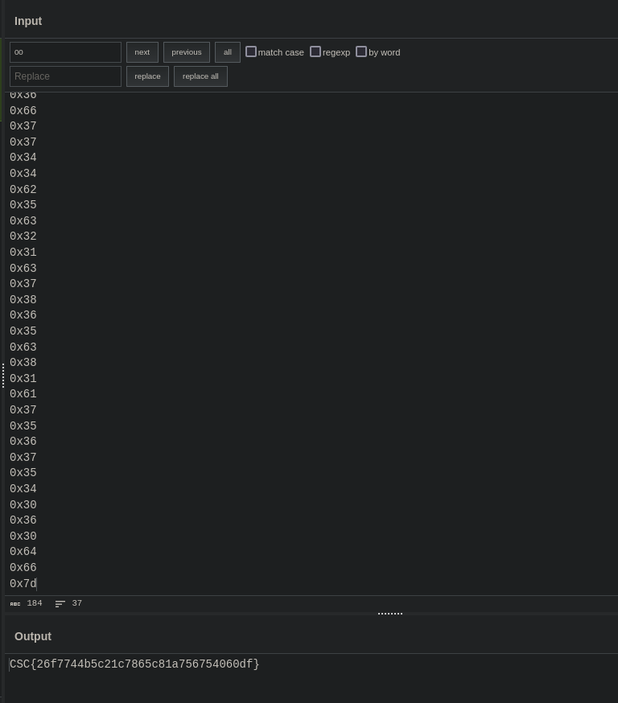

# CaptureTheFutoor Forensics challenge 2

When inspecting the `capture.pcap` file, we can see that most most of it is just ICMP packets (ping). Other packets aren't that significant.



Too much ICMP packets isn't usual right?

When looking at all of those packets, everything is normal. Except for the checksum of each ICMP packet. The checksum isn't correct for each one. AND the checksum is in the range of ASCII. The challenge is very clear now. 



We can take each one of those checksums and convert it to ascii. You can try manually or do it using tshark like this:

```tshark -r ./capture.pcap -Y 'icmp and ip.dst == 31.41.59.26' -T fields -e 'icmp.checksum'```



We can use cyberchef to decode the flag:

