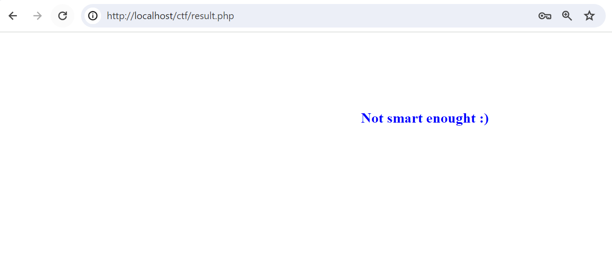
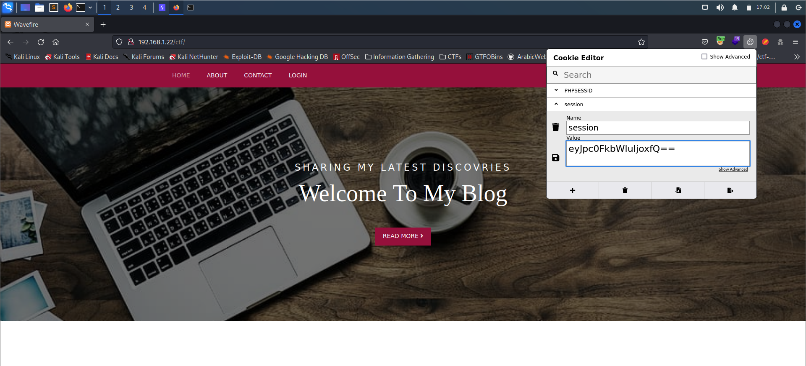
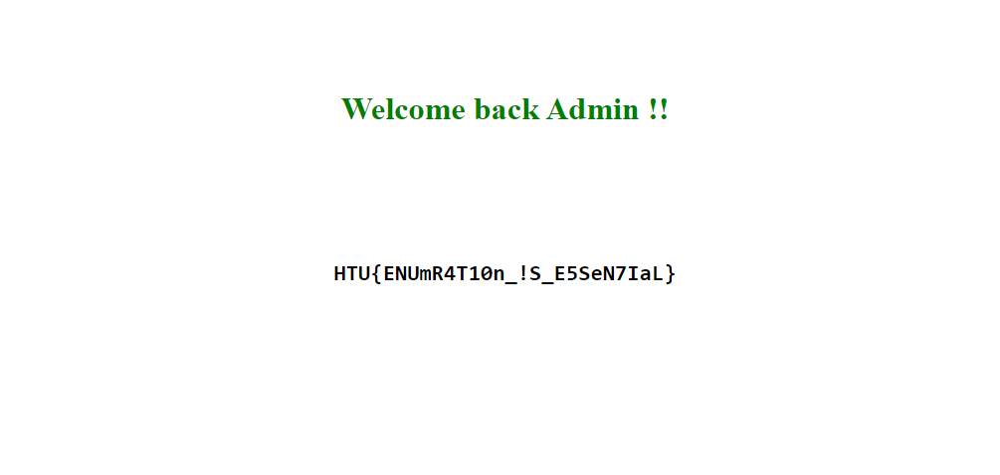

# Blog Writeup

28th March 2024

​**Challenge Author:** Kudo

​**Difficulty:** Easy

​**Classification:** Official

# Synopsis

- The challenge involves discovering the password needed for a login page in an entry file listed in `robots.txt`, along with manipulating cookies for check bypass.

## Description

* My blog is secured with multiple layers of protections. You can't hack it!!

## Skills Required

- Basic knowledge about Cookies 
- Knowing common attacked files
- Basic knowledge about Base64 encoding

## Skills Learned

- Enumeration
- Cookies Manipulation
- Using public online Encoders/Decoders

## Application Overview

The website is simple, there is only one login page:

## Enumeration

We start here examining different mix of usernames and passwords and examine the result. We can say that the username is `admin` but the password is unknown.

Since we don't have any kind of actions to do, we can try some know files brutforcing. `robots.txt` file is found in the server, which is responsible for telling the web crawlers to not look and put the listed directories in the search results. There is an file called `backup.txt`.

It has the following content:

Now, after we got the credentials we can try to login again. However, this message appear:

It seems that we still miss something. If we continue our enumeration and examine our cookies, we find the `session` one. One of the easiest methods for dealing with cookies is using the "Cookie-Editor" browser extenstion, avilable on Chrome and Firefox.

## Exploiting

The value of the cookie is encrypted or encoded. On of the first and common things to try is `base64` encoding. So, we try to decode it with any online decoders, like [Cyberchef](https://gchq.github.io/CyberChef/) or Burpsuit's Decoder, we can see this JSON string.

The app checks our `session` cookie value in the login function, and if the `idAdmin` is `0` (which is false), it won't grant us in. So, we will change it to `1` and encoded back to `base64`, i.e. its original format:

Now, we should be able to login with  the discovered credentials and the updated cookies. Here is our FLAG.

