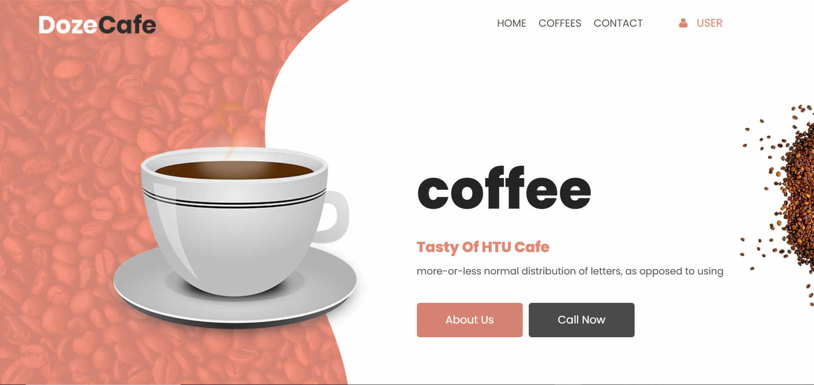
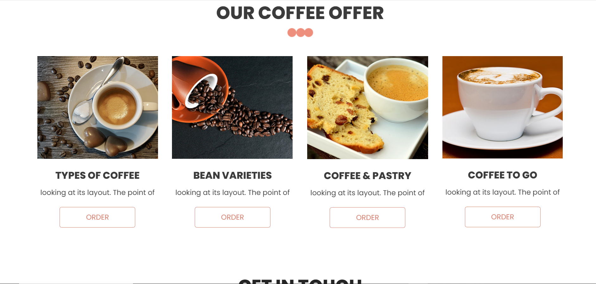
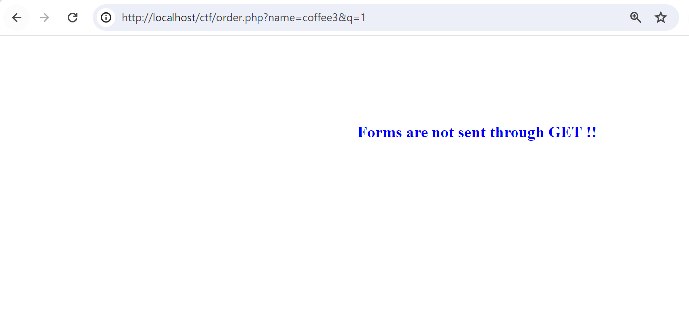
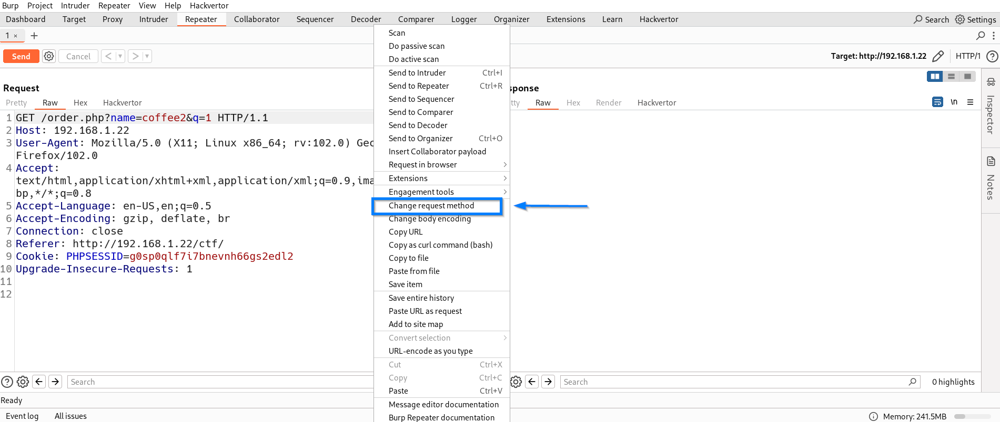
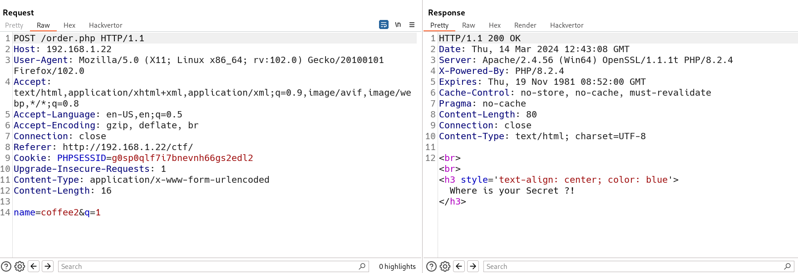
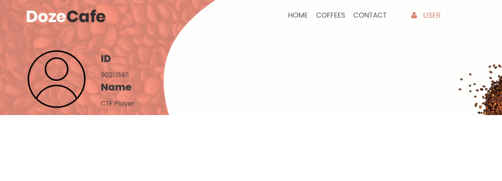
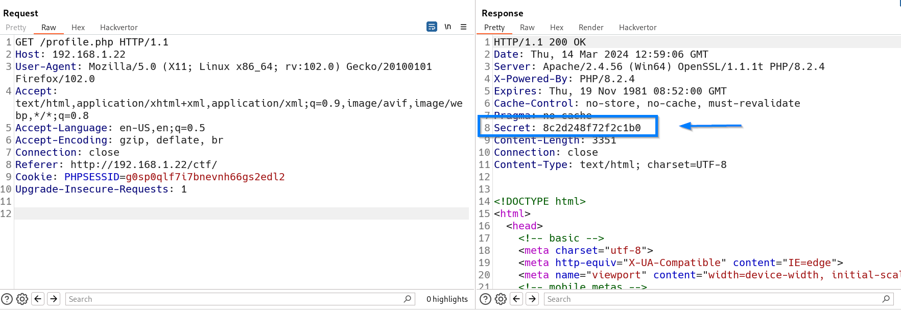
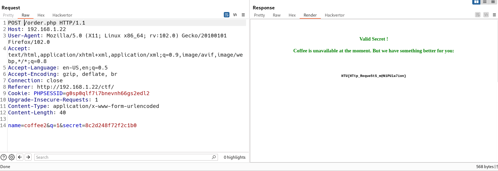

Hidden Secret

28th March 2024

​**Challenge Author:** Kudo

​**Difficulty:** Easy

​**Classification:** Official

# Synopsis

- The challenge involves a profile page and ordering coffee functionality, that needs a secret value to be sent through `POST` request.

## Description

* Do you want to have a coffee or flag ??

## Skills Required

- Basic skills in Burpsuit
- Understanding of the HTTP protocol

## Skills Learned

- Enumeration.
- HTTP Request manipulation

## Application Overview

When we check the website for its functionalities, we discover that we can do:
- Viewing our profile: It displays our generated ID with our name. They can't be modified.
- Ordering Coffee: Error message appear when clicking any order.

## Coffee Ordering

From the message, we can know that it isn't expecting a `GET` request. This make sense, because forms are sent through `POST` request; so the the data aren't displayed in the URL.

We can intercept the request and change it to `POST` using Burpsuit:

We can see a new message in the response:

It seems that we need a `secret` value within our request, as a form of `POST` parameter; because it is the only way we can send data in our request to the server. If we tried any value for it, it will tell us "Incorrect Secret". So, where we can get this `secret` from ?

## Finding the Secret

Examining our profile again, we yet don't get any mention for "secret" here in our profile:

We should intercept the request any see what is going on using Burpsuit.
It seems like a normal request-response communication. But we should always look for all headers involved in this communication, because it may exfiltrate many important information regarding the back-end environment nature, like the server running and it version, the language used in this website, etc.

We can observe a non-traditional header in the response, which is clearly our target, the `secret`:

Updating our request with the new `secret` value, we get our FLAG.

