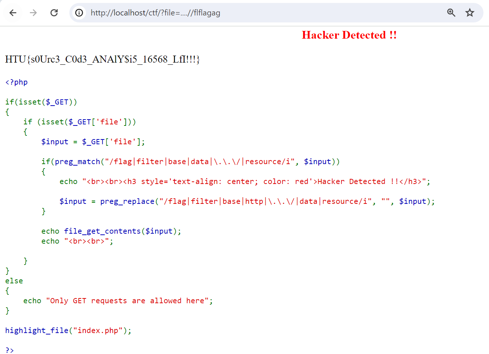

<font size="10">Spot it</font>

28<sup>th</sup> March 2024

​**Challenge Author:** Kudo

​**Difficulty:** <font color=Orange>Medium</font>

​**Classification:** Official

# Synopsis

- The challenge involves a PHP code to be reviewed to find LFI vulnerability and escape some filtration on the payload.

## Description

* I have given you the source code, is that enough for you ?
* *Note: The flag file is `flag.php` which exsists in the parent directory.*

## Skills Required

- Solid knowledge about PHP
- Knowledge about Local File Inclusion (LFI)
- Ability to look for online payloads

## Skills Learned

- Source Code Analysis
- LFI filtration bypass

## Application Overview

We are presented with the source code, written in `PHP`:

```php
<?php

if(isset($_GET))
{
  if (isset($_GET['file']))
  {
    $input = $_GET['file'];

    if(preg_match("/flag|filter|base|data|\.\.\/|resource/i", $input))
    {
      echo "<br><br><h3 style='text-align: center; color: red'>Hacker Detected !!</h3>";

      $input = preg_replace("/flag|filter|base|http|\.\.\/|data|resource/i", "", $input);
    }

    echo file_get_contents($input);
    echo "<br><br>";

  }
}
else
{
  echo "Only GET requests are allowed here";
}

highlight_file("index.php");

?>
```

## Code Break Down

After inspecting the code, it does the following:
- It checks if we have used a GET parameter named `file` in our request.
- If our parameter value contains any of these words, case insensitively: (flag, filter, base, http, ../ , data, resource), then it will remove it.
- It will get the content of the resulted filename, after filtration and removal, and render it back to us.

## Exploitation

Since we know that the file is in the parent directory, we must use the `../` to get back to the previous folder. However, as soon as it looks for it, it will remove it from our payload. 
But what if doubled them, so after the removal, it will result in our desired form, as shown below:

```
../banana => banana

....//banana
..(../)/banana   () is discovered and removed
../banana
```

And the same is applied for the word "flag", since it is being filtered also.

```
../flag => ../

../flflagag
../fl(flag)ag   () is discovered and removed
../flag
```

So, the final payload for us will be like this:
```
?file=....//flflagag
```
And the output is our FLAG:


